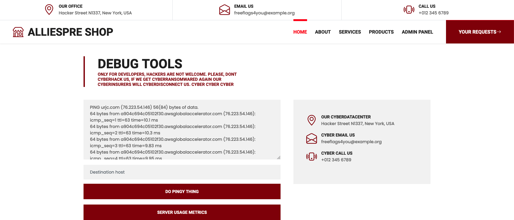

# aliespres

Inspeccionando la página web, nos llama la atención el apartado de `ADMIN PANEL`. Aqui podemos ver varias opciones



La opción `DO PINGY THING` es curiosa, metemos un host para probar que hace la página web.


Vemos que se está ejecutando comandos, teniendo en cuenta nuestra entrada. Vamos a analizar el código de la página.

```python
package th.ctf.alliespre.service.ping;

import org.springframework.stereotype.Service;

@Service
public class ServerStatus {
    public String doPing(String target){
        String args = "ping -c 4 " + target;
        var command = new Command(args);
        return command.doCommand();
    }

    public String usageStats(){
        String args = "free -h";
        var command = new Command(args);
        return command.doCommand();
    }
}
```

En este caso `target` lo está introduciendo el usuario, y lo está concatenando para hacer un ping a un servicio. En este caso, para vulnerarlo mediante los operadores `($xxx)` podemos inyextar comandos. Vamos a probar con whoami a ver que se esta ejecutando.


Vemos que el ping lo ha hecho a `root.greita.numa.host`, `root` es directamente la salida de `($whoami)`, por lo que podremos interactuar directamente con la máquina.

El archivo `Dockerfile` vemos que esta copiando el archivo `flag.txt` al `WORKDIR` por lo que al hacer `cat flag.txt` podremos leer el archivo.


