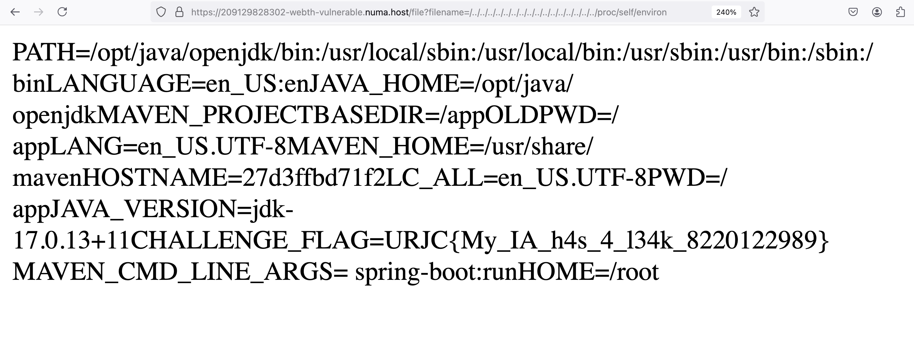

Nos encontramos con una web basica, con `index.html` y `styles.css`.

Analizando el código proporcionado veo que el código principal es estatico, y que contiene el siguiente archivo de javascript:

```jsx
package th.challs.underconstruction;

import org.slf4j.Logger;
import org.slf4j.LoggerFactory;
import org.springframework.stereotype.Controller;
import org.springframework.web.bind.annotation.GetMapping;
import org.springframework.web.bind.annotation.RequestParam;
import org.springframework.web.bind.annotation.ResponseBody;

import java.io.IOException;
import java.nio.file.Files;
import java.nio.file.Path;

@Controller
public class Web {
    public static final String STATIC_PATH = "/app/src/main/resources/static/";
    private static Logger logger = LoggerFactory.getLogger(Web.class);

    @GetMapping("/")
    @ResponseBody
    public byte[] index() throws IOException {
        // https://media.giphy.com/media/ANbD1CCdA3iI8/giphy.gif
        return Files.readAllBytes(Path.of(STATIC_PATH, "index.html"));
    }

    @GetMapping("/healthcheck")
    @ResponseBody
    public String healthcheck(){
        logger.info("Health ok");
        return "Health ok";
    }

    @GetMapping("/file")
    @ResponseBody
    public byte[] serveFile(@RequestParam String filename) throws IOException {
        logger.info("Serving file: {}", filename);
        return Files.readAllBytes(Path.of(STATIC_PATH, filename));
    }
}
```

Me fijo en la ultima función la cual se incluye cuando se pide a la web `/file`, y esta misma observa el parametro `filename` y lee el archivo que se pide en el directorio `STATIC_PATH` el cual ha sido definido al principio: `/app/src/main/resources/static/`. 

Lo primero que pienso es comprobar si la pagina web esta protegida contra el ataque path traversal. Para ello comprobamos que podemos visualizar el archivo `/etc/passwd` por lo que podremos visualizar cualquier archivo dentro de la maquina.

Aquí es donde viene el principal problema, ¿donde busco?

Lo primero que hago es empezar a buscar sitios clasicos como:

- `/home/flag.txt`
- `/root/flag.txt`
- `/flag.txt`

Sin embargo me doy cuenta que estoy asumiendo que el archivo que contiene la flag se llama `flag.txt`.

Observando los archivos para montar el entorno, veo que en el archivo `docker-compose.yml` una variable de entorno llamada `CHALLENGE_FLAG` (como en todos los retos). Y empiezo a buscar en que parte del entorno montado puede estar escribiendo la flag en algun archivo dentro del sistema.

Lo que he llegado a sacar es que para montar el contenedor docker, el archivo `Dockerfile` emplea la aplicación maven, que tras una busqueda rápida, veo que es una herramienta para gestionar productos basados en java. Y tras ver la siguiente linea:

```jsx
CMD ["mvn", "spring-boot:run"]
```

veo que se están ejecutando `mvn` para montar todo el entorno de java. Decido mandarlo a un log, para examinarlo y ver si es el que está asignado el valor de la flag a algún archivo. Sin embargo lo único que encontramos de las 1298 lineas, son estas dos coincidencias:

```jsx
❯ cat log.txt | grep -n "FLAG"
450:[DEBUG] env.CHALLENGE_FLAG: flag{empty}
842:[DEBUG] env.CHALLENGE_FLAG: flag{empty}
```

Y viendo el contexto no sacamos donde puede estar escribiendo la flag.

Intento hacer un grep local para buscar algún archivo donde encuentre la variable `CHALLANGE_FLAG` redirigiendo los errores a null para tener una salida limpiar pero no encontramos nada: `grep -r "CHALLENGE_FLAG" / 2>/dev/null`.

Se me ocurre revisar las clases java y veo que se esta solicitando un paquete llamado `th.challs.underconstruction` pero tras inspeccionar dentro del direcctorio `/app/target` y tras extraer con el comando `jar xf underconstruction-0.0.1-SNAPSHOT.jar.original` no encuentro nada relacionado con el path donde se puede estar guardando la flag.

Tras no obtener ninguna información de ello de manera local vuelvo a probar con directorios comunes en linux. Y tras una larga busqueda y unos cuantos intentos caigo en el directorio `/proc/self/environ` el cual tiene la flag guardada.



A pesar de haber conseguido la flag un poco de manera “aleatoria” no encuentro ningún archivo/indicio en la maquina montada localmente donde pueda escribir la variable `CHALLENGE_FLAG` en el archivo ubicado en `/proc/self/environ`. Preguntar donde esta

---

Escrito despues de haber encontrado la flag: podría haber utilizado burpsuit para automatizar la busquedad de archivos comunes en maquinas linux como pueden ser el `/etc/passwd`, `/etc/shadow`, etc; y luego haber filtrado las salidas para buscar la palabra `URJC{`.
