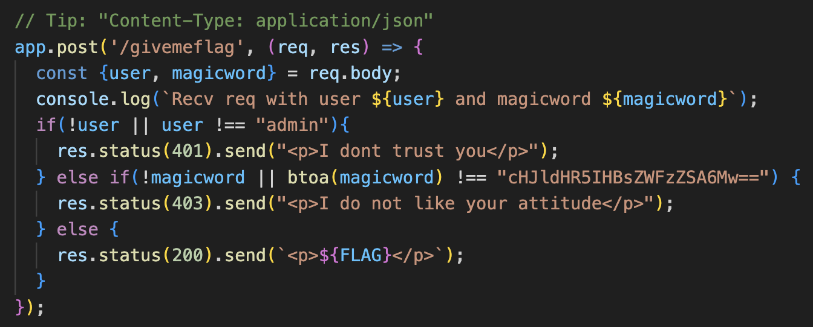
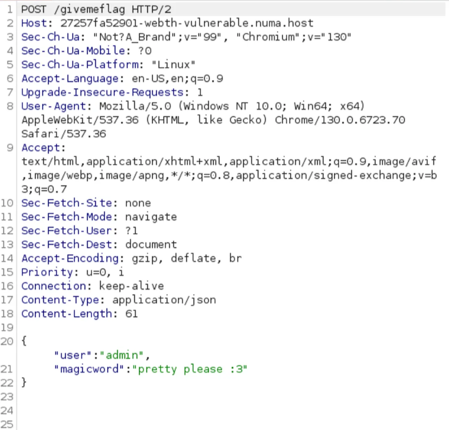
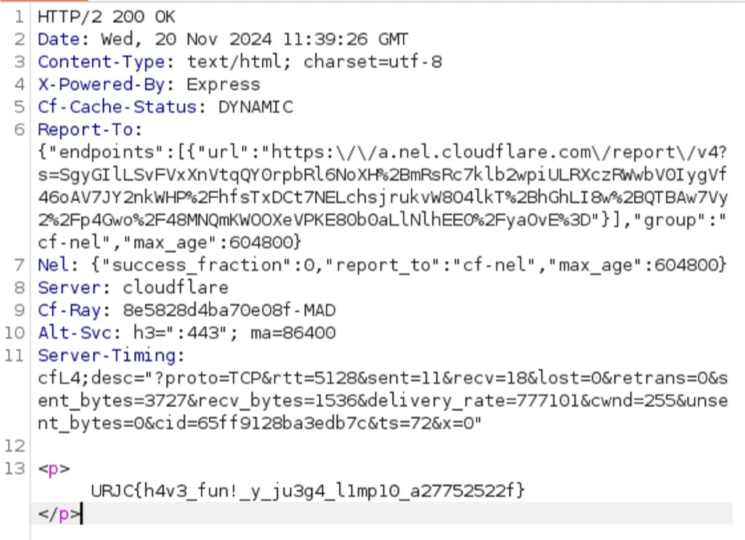

# porfaplis

Para resolver este reto, lo montamos primero en local con docker. 

Lo primero que llama la atención es el archivo `server.js`, el cual si lo analizamos vemos que dependiendo de que tipo de solicitud hagamos al la pagina web, actuará de una manera u otra.

Viendo el código nos fijamos en esta parte:

Vemos que para llegar al `else` final debemos cumplir las siguientes condiciones:

- Primero de todo, que con el metodo `POST`, pedir `/givemeflag`.
- Como vemos que el código existen dos variables: `user` y `magicword`, las cuales se encuentran en los parametros del body de la request.
    - Para el `user`, añadiremos la calve `user` con valor `admin`.
    - Para la `magicword`, vemos que la cadena de texto `cHJldHR5IHBsZWFzZSA6Mw==` está en base64. Descrifrado a texto en claro vemos que el texto es `pretty please :3`. Lo que hace es convertir esa magic word a binario con la funcion `btoa` y lo comprueba.

Si realizamos la solicitud de esta manera nos damos cuenta que no conseguimos nada. Si nos fijamos el propio código, vemos que nos da un tip: que el contex-type sea de tipo application/json. Cambiando esto desde el repeter en burpsuit llegamos a una solicitud que tiene esta pinta:

Y veremos que la respuesta del servidor, ya nos devuelve la flag

